<div align="center">


</div>

```c
/* ~/about_me.c */
#include "fducrot.h"

int	main(void)
{
	t_dev	me;

	me.school   = "42 Lausanne";
	me.status   = PISCINE_SURVIVED;
	me.focus    = {"C", "C++", "Unix", "Networks", "Docker"};
	me.building = "WebServ — an HTTP/1.1 server from scratch";
	me.location = "Switzerland 🇨🇭";
	return (keep_coding(&me));
}
```

## `$ ls ~/stack`

<p align="left">
  
</p>

## `$ ls -lt ~/projects | head`

<p align="center">
  <a href="https://github.com/FiTcHeRs71/WebServ"></a>
  <a href="https://github.com/FiTcHeRs71/42-Mini-Shell"></a>
  <a href="https://github.com/FiTcHeRs71/42-Cub3D"></a>
  <a href="https://github.com/FiTcHeRs71/42bet"></a>
  <a href="https://github.com/FiTcHeRs71/42-Inception"></a>
</p>

| Projet | Ce que ça fait | Stack |
|---|---|---|
| 🌐 **WebServ** | Serveur HTTP/1.1 non-bloquant (poll), CGI, config type nginx | C++98 |
| 🐚 **Minishell** | Shell bash-like : lexer, parser récursif → AST, pipes, redirections, signaux | C |
| 🎮 **Cub3D** | Moteur 3D raycasting façon Wolfenstein 3D avec la miniLibX | C |
| ⚽ **42Bet** | Pronostics foot sans argent pour les étudiants de 42 Lausanne, classement par coalition | TypeScript |
| 🐳 **Inception** | Infra NGINX + WordPress + MariaDB, chaque service dans son conteneur Docker | Docker |

## `$ wakatime --this-week`

<!--START_SECTION:waka-->

```txt
From: 18 September 2026 - To: 25 September 2026

Total Time: 4 hrs 46 mins

Markdown     1 hr 42 mins          █████████░░░░░░░░░░░░░░░░   35.71 %
C            59 mins               █████░░░░░░░░░░░░░░░░░░░░   20.61 %
Text         20 mins               █▓░░░░░░░░░░░░░░░░░░░░░░░   07.06 %
C++          5 mins                ▓░░░░░░░░░░░░░░░░░░░░░░░░   02.02 %
Git Config   0 secs                ░░░░░░░░░░░░░░░░░░░░░░░░░   00.28 %
```

<!--END_SECTION:waka-->

<p align="center">
  
  
</p>

## `$ git log --stat`

<p align="center">
  
  
</p>


<p align="center">
  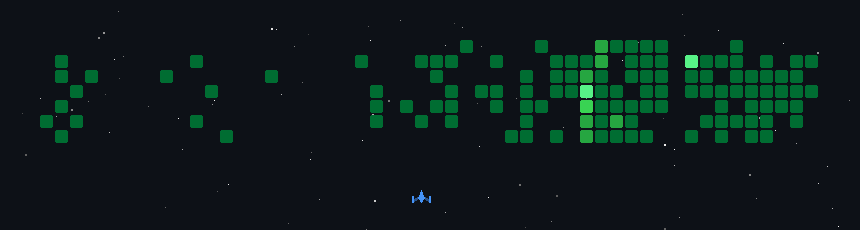
</p>

```console
fducrot@42lausanne:~$ exit
logout — merci de ta visite ✌️
```
